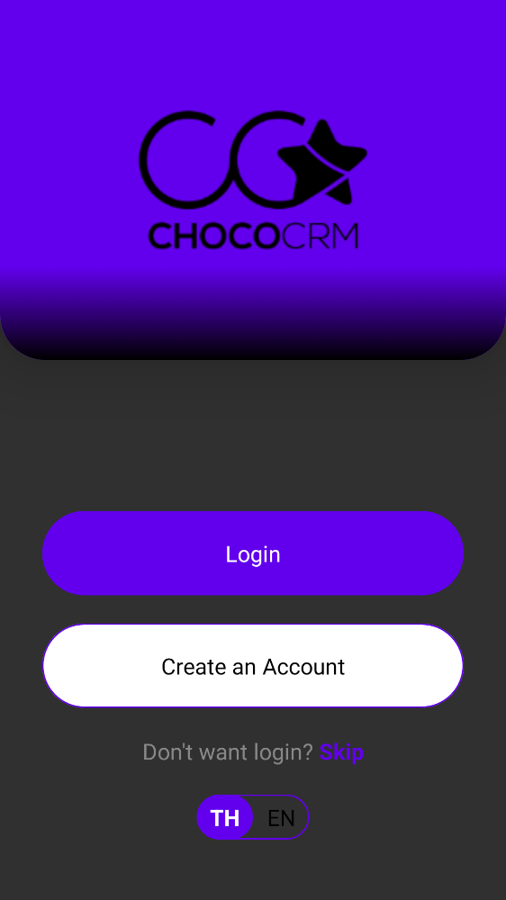
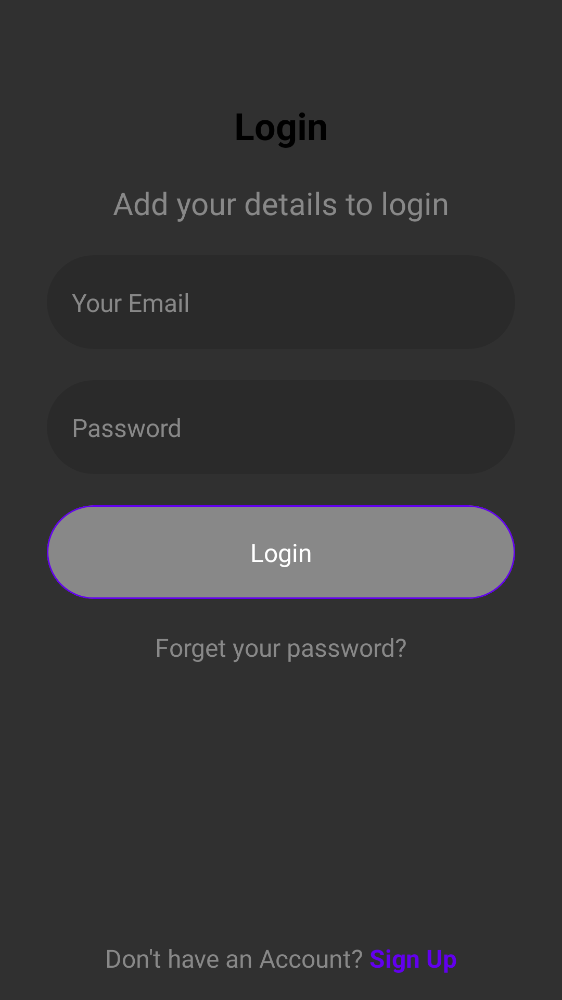
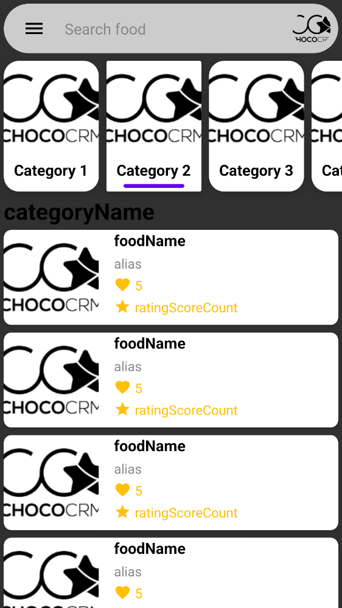
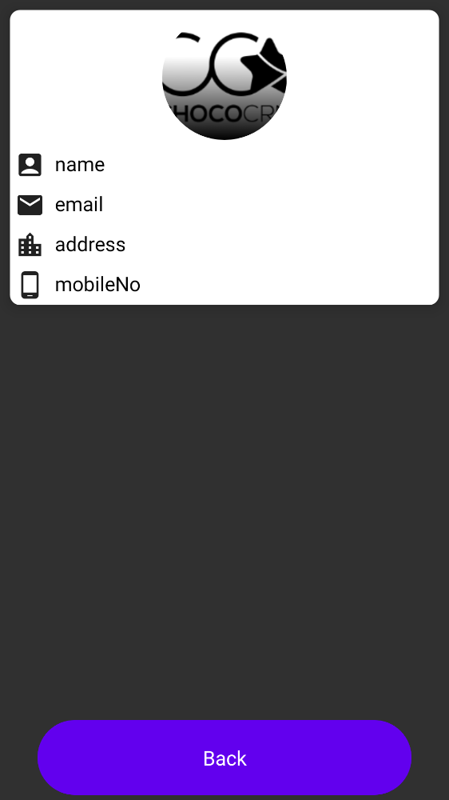
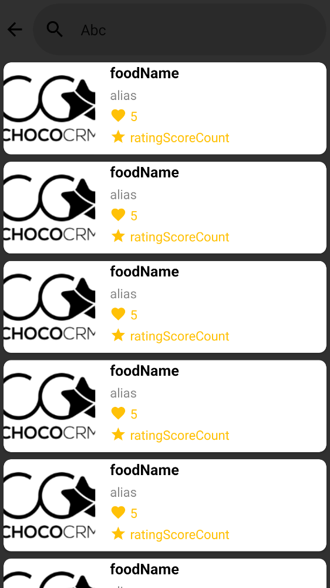
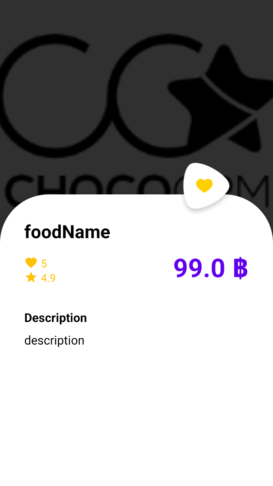

My Food
==================

- UI toolkit - Jetpack compose

- Architecture - MVVM/MVI + Clean architecture

- Programming - Kotlin

- Remote data source - Ktor

- Asynchronous - Coroutines

- Storage - SQLDelight, Data store

- Dependency injection - Koin

- Test - UI test(Compose), Mockk, Truth, Screenshot test(Showkase, Paparuzzi)

- Gradle - KTS

- Other - Lottie, Coil, Navigation compose

# Testing

- Record
```
./gradlew testDevelopDebug
```

- Record
```
./gradlew recordPaparazziDevelopDebug
```

- Verify
```
./gradlew verifyPaparazziDevelopDebug
```

# Structure

- app `:app`
  - myfood `:myfood`
    - presentation
      - view `:core:ui_components`
        - splash screen `:features:splash_screen`
        - welcome `:features:welcome`
        - authentication `:features:authentication`
        - main `:features:main`
        - user profile `:features:user_profile`
        - search food `:features:search_food`
        - food detail `:features:food_detail`
        - connectivity `:features:connectivity`
      - view model
    - domain
      - use case
        - user profile `:domain:user_profile`
        - web sockets `:domain:web_sockets`
    - data `:core`
      - repository
      - data source
        - profile `:data:profile`
        - web sockets `:data:web_sockets`
        - food `:data:food`
        - favorite `:data:favorite`

- showkase `:showkase`

# Features

- Splash screen
- Welcome
- Authentication
- Main
- User profile
- Search food
- Food detail
- Connectivity







